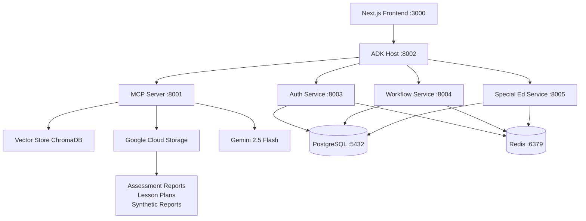

# TLA Educational Platform - System Architecture & Code Map

**Document Created**: 2025-06-22  
**Last Updated**: 2025-06-22  
**System Status**: Fully Operational ✅

## 🏗️ High-Level Architecture



## 🎯 System Purpose

**TLA Educational Platform** is a RAG-powered (Retrieval-Augmented Generation) educational assistant designed for special education professionals. It provides:

- **Intelligent Chat Interface** with document-based context
- **Assessment Report Analysis** using real student data
- **IEP Generation** with evidence-based recommendations  
- **Lesson Planning** with adaptive strategies
- **Progress Monitoring** and data visualization

## 📁 Directory Structure

```
/Users/anshu/Documents/GitHub/
├── tlaongcloudv1/                    # Backend Services
│   ├── backend/
│   │   ├── common/                   # Shared utilities
│   │   ├── auth_service/             # Authentication & authorization
│   │   ├── workflow_service/         # Business process management
│   │   ├── special_education_service/# Special ed domain logic
│   │   ├── mcp_server/              # Model Context Protocol server
│   │   └── adk_host/                # API gateway & LLM integration
│   ├── docker-compose.yml
│   ├── .env
│   └── STARTUP_CONFIG.md
└── v0-tla-front-endv01/             # Frontend Application
    ├── app/                         # Next.js app router
    ├── components/                  # React components
    ├── lib/                         # Utilities & API clients
    └── .env.local
```

## 🔄 Data Flow Architecture

### 1. Chat Query Flow
```
User Query → Frontend → ADK Host → MCP Server → Vector Search → Gemini → Response
```

### 2. Document Processing Flow
```
GCS Upload → Document Processor → Text Chunking → Embeddings → Vector Store
```

### 3. Authentication Flow
```
Frontend → ADK Host → Auth Service → JWT Validation → Protected Resources
```

## 🎛️ Core Services Detail

### Frontend Layer (Next.js)
**Port**: 3000  
**Tech Stack**: Next.js 15.2.4, React, TypeScript, Tailwind CSS

#### Key Components:
```typescript
// Chat Interface
/app/(authenticated)/chat/page.tsx
/components/chat/chat-interface.tsx      // Main chat UI
/components/chat/document-selector.tsx   // Document library integration

// API Integration  
/lib/api-client.ts                      // Multi-service API client
/lib/llm-client.ts                      // LLM interaction wrapper

// UI Components
/components/ui/                         // Shadcn/ui component library
/components/enhanced-sidebar.tsx        // Navigation system
```

### ADK Host (API Gateway)
**Port**: 8002  
**Tech Stack**: FastAPI, Python 3.11, Google Vertex AI

#### Key Classes:
```python
# /backend/adk_host/src/main.py
class QueryRequest(BaseModel)           # Request validation
class QueryResponse(BaseModel)          # Response formatting  
class Source(BaseModel)                 # Document source metadata

# Core Functions:
async def process_query()               # Main query endpoint
async def generate_rag_response()       # Gemini integration
async def call_mcp_tool()              # MCP server communication
```

### MCP Server (Document & Vector Management)
**Port**: 8001  
**Tech Stack**: FastAPI, ChromaDB, Vertex AI Embeddings

#### Key Classes:
```python
# /backend/mcp_server/src/main.py
class MCPRequest(BaseModel)             # MCP protocol requests
class MCPResponse(BaseModel)            # MCP protocol responses

# Core Functions:
async def retrieve_documents_impl()     # Vector similarity search
async def retrieve_iep_examples_impl()  # Educational content retrieval
async def process_documents()           # Batch document processing
```

### Auth Service (Authentication & Authorization)
**Port**: 8003  
**Tech Stack**: FastAPI, JWT, PostgreSQL, Redis

#### Key Classes:
```python
# /backend/auth_service/src/models/
class User(SQLAlchemyBase)              # User entity
class UserSession(SQLAlchemyBase)       # Session management
class LoginRequest(BaseModel)           # Authentication request
class TokenResponse(BaseModel)          # JWT token response
```

### Special Education Service (Domain Logic)
**Port**: 8005  
**Tech Stack**: FastAPI, SQLAlchemy, Vector Store Integration

#### Key Classes:
```python
# /backend/special_education_service/src/models/
class Student(SQLAlchemyBase)           # Student profile
class IEP(SQLAlchemyBase)              # Individualized Education Program
class Assessment(SQLAlchemyBase)        # Assessment records
class Goal(SQLAlchemyBase)             # IEP goals and objectives

# /backend/special_education_service/src/routers/
advanced_iep_router.py                 # IEP generation with RAG
student_router.py                      # Student management
assessment_router.py                   # Assessment data
```

### Workflow Service (Business Process)
**Port**: 8004  
**Tech Stack**: FastAPI, SQLAlchemy, Email Integration

#### Key Classes:
```python
# /backend/workflow_service/src/models/
class WorkflowInstance(SQLAlchemyBase)  # Process execution
class WorkflowStep(SQLAlchemyBase)     # Individual workflow steps
class Approval(SQLAlchemyBase)         # Approval tracking
class Notification(SQLAlchemyBase)     # System notifications
```

## 🧠 Common Utilities (Shared Library)

### Configuration Management
```python
# /backend/common/src/config/settings.py
class Settings(BaseSettings)           # Centralized configuration
def get_settings() -> Settings         # Cached settings instance
```

### Document Processing Pipeline
```python
# /backend/common/src/document_processor.py
class DocumentProcessor:
    def __init__(project_id, bucket_name)
    def list_documents() -> List[str]          # GCS document discovery
    def process_document(blob_name) -> List    # Single document processing
    def create_embeddings(texts) -> List       # Vertex AI embeddings
    def process_all_documents() -> Dict        # Batch processing
```

### Vector Store Abstraction
```python
# /backend/common/src/vector_store/
class VectorStore:                     # ChromaDB implementation (dev)
    def add_documents(chunks)          # Store document chunks
    def search(query_embedding) -> List # Similarity search
    def clear()                        # Vector store cleanup

class VertexVectorStore:               # Google Vertex AI (prod)
    @classmethod
    def from_settings(settings)        # Factory method
    def search(query_embedding) -> List # Production vector search
```

## 🔗 Integration Points

### Google Cloud Platform
- **Project ID**: `thela002`
- **GCS Bucket**: `betrag-data-test-a` (18 documents: PDFs, DOCX, TXT)
- **Vertex AI**: Text embeddings (`text-embedding-004`)
- **Gemini**: `gemini-2.5-flash` model (8192 max tokens)
- **Authentication**: Application Default Credentials

### Database Layer
```sql
-- PostgreSQL Databases
special_education_db    -- Main application data
auth_db                -- User authentication
test_db                -- Testing environment

-- Redis Cache
Session storage, API caching, rate limiting
```

### External APIs
- **Google Cloud Storage**: Document repository
- **Vertex AI Embeddings**: Text vectorization
- **Gemini API**: Large language model inference
- **ChromaDB**: Local vector database (development)

## 🔍 Key Algorithms & Patterns

### RAG (Retrieval-Augmented Generation)
```python
# Query Processing Pipeline
1. User query → Text embedding (Vertex AI)
2. Vector similarity search (ChromaDB/Vertex)
3. Context assembly (top-k documents)
4. LLM prompt construction (formatted context)
5. Gemini generation (educational assistant)
6. Response formatting (sources + answer)
```

### Document Processing Pipeline
```python
# Document Ingestion Flow
1. GCS blob discovery → List all supported files
2. Download → Temporary local storage
3. Content extraction → PyPDF, Docx2txt, TextLoader
4. Text chunking → RecursiveCharacterTextSplitter
5. Embedding generation → Vertex AI text-embedding-004
6. Vector storage → ChromaDB with metadata
7. Cleanup → Remove temporary files
```

### Authentication Flow
```python
# JWT-based Authentication
1. Login request → Email/password validation
2. JWT generation → Access + refresh tokens
3. Session tracking → Redis-based storage
4. Token validation → Middleware interceptor
5. Auto-refresh → Transparent token renewal
```

## 🛡️ Security Architecture

### Authentication & Authorization
- **JWT Tokens**: HS256 algorithm, 30-minute access tokens
- **Session Management**: Redis-based with cleanup
- **CORS**: Configured for localhost development
- **Rate Limiting**: API endpoint protection

### Data Protection
- **Environment Variables**: Sensitive config in .env files
- **GCP Credentials**: Application Default Credentials
- **Database**: Connection string encryption
- **File Processing**: Temporary file cleanup

## 📊 Performance Characteristics

### Response Times (Observed)
- **Health Checks**: ~10-50ms
- **Document Retrieval**: ~300-500ms
- **Chat Queries**: ~3-15 seconds (includes LLM generation)
- **Document Processing**: ~30 seconds for 18 documents

### Scalability Patterns
- **Stateless Services**: Horizontal scaling ready
- **Database Connection Pooling**: Configurable pool sizes
- **Redis Caching**: Session and API response caching
- **Vector Search**: ChromaDB → Vertex AI migration path

## 🔧 Configuration Management

### Environment Detection
```python
ENVIRONMENT=development  # ChromaDB, detailed logging
ENVIRONMENT=production   # Vertex AI, optimized performance
```

### Service Configuration
```python
# Model Parameters
GEMINI_MODEL=gemini-2.5-flash
gemini_max_tokens=8192           # Maximum response length
gemini_temperature=0.4           # Creativity vs consistency

# Vector Search
embedding_model=text-embedding-004
chunk_size=1000                  # Document chunk size
chunk_overlap=200                # Overlap for context preservation
```

## 🐛 Error Handling & Monitoring

### Logging Strategy
- **Structured Logging**: JSON format for production
- **Debug Information**: Detailed development logs
- **Request Tracing**: Correlation IDs across services

### Fallback Mechanisms
- **Vector Store**: Vertex AI → ChromaDB fallback
- **LLM Generation**: Gemini errors → Graceful degradation
- **Service Communication**: Retry logic with exponential backoff

## 🚀 Deployment Architecture

### Development Environment
```bash
# Local development setup
Docker Compose: All backend services
Next.js dev server: Frontend hot reload
PostgreSQL/Redis: Containerized databases
ChromaDB: Local vector storage
```

### Dependencies & Versions
```python
# Core Framework Versions
fastapi==0.104.1
sqlalchemy==2.0.25
chromadb==0.4.22
vertexai==1.38.1
numpy<2.0                    # ChromaDB compatibility
```

## 📈 Future Architecture Considerations

### Scalability Roadmap
1. **Microservice Decomposition**: Further service separation
2. **Container Orchestration**: Kubernetes deployment
3. **Vector Database**: Migration to production Vertex AI
4. **Caching Layer**: Redis clustering for high availability
5. **Monitoring**: Observability with OpenTelemetry

### AI/ML Pipeline Evolution
1. **Model Versioning**: A/B testing different LLM versions
2. **Custom Embeddings**: Fine-tuned embeddings for education domain
3. **Multi-modal**: Support for images, audio in assessments
4. **Real-time Processing**: Streaming document updates

---

**Architecture Notes for AI Tools:**

This system implements a sophisticated RAG architecture for educational content generation. Key patterns include:
- **Microservices**: Domain-driven service separation
- **Event-driven**: Async processing with proper error handling  
- **Vector Search**: Semantic similarity for document retrieval
- **LLM Integration**: Structured prompts with educational context
- **Multi-tenant**: Designed for multiple schools/districts
- **Observability**: Comprehensive logging and health monitoring

The codebase follows modern Python/TypeScript patterns with strong typing, dependency injection, and clean architecture principles.